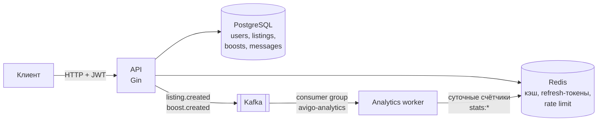

# Avigo

Маркетплейс объявлений: Go (Gin) + PostgreSQL (pgx) + Redis + Kafka.

## Стек

- **API** — Gin, JWT (access + refresh), bcrypt, per-IP rate limiting на auth-роутах
- **БД** — PostgreSQL через pgxpool (пул с лимитами и таймаутами, индексы под горячие запросы)
- **Redis** — кэш списков объявлений (версионируемые ключи), refresh-токены, rate limit, счётчики аналитики
- **Kafka** — события `listing.created`, `boost.created` (acks от всех ISR); воркер-консьюмер с at-least-once
- **Наблюдаемость** — structured logging (slog, JSON), request-id, Prometheus-метрики, liveness/readiness probes

## Архитектура



Два бинарника из одного модуля:

- `cmd/api` — HTTP API;
- `cmd/worker` — консьюмер Kafka: читает `listing.created` и `boost.created`
  в consumer group `avigo-analytics` и ведёт суточные счётчики
  `stats:<topic>:<YYYY-MM-DD>` в Redis (TTL 90 дней). Семантика at-least-once:
  offset коммитится после обработки; битое событие логируется и пропускается,
  чтобы не блокировать партицию. Останавливается gracefully по SIGTERM.

## Запуск

```bash
cp .env.example .env      # заполнить JWT_SECRET — без него приложение не стартует
docker compose up --build
```

API поднимется на `http://localhost:8080` (kafka-ui — на `http://localhost:8090`),
воркер аналитики стартует отдельным контейнером.
Миграции из `backend/migrations` применяются автоматически при первой инициализации Postgres.

Локально без Docker:

```bash
cd backend
make run        # или: go run ./cmd/api
```

### Переменные окружения

| Переменная       | По умолчанию            | Описание                                    |
|------------------|-------------------------|---------------------------------------------|
| `APP_PORT`       | `8080`                  | HTTP-порт                                   |
| `POSTGRES_DSN`   | локальный Postgres      | DSN подключения к Postgres                  |
| `REDIS_ADDR`     | `localhost:6379`        | Адрес Redis                                 |
| `KAFKA_BROKERS`  | `localhost:9092`        | Kafka broker (с хоста — `localhost:29092`)  |
| `JWT_SECRET`     | — (**обязательна**)     | Секрет подписи JWT                          |
| `BOOST_DURATION` | `24h`                   | Срок действия буста (Go duration)           |

## Аутентификация

`POST /auth/register` → регистрация (email + пароль от 8 символов; дубликат email — `409`).

`POST /auth/login` → пара токенов: access (15 мин) и refresh (7 дней).

Refresh-токены хранятся в Redis и **одноразовые**: `POST /auth/refresh` инвалидирует
использованный токен и выдаёт новую пару (ротация). Повторное использование старого,
отозванного или утёкшего refresh-токена отклоняется с `401`.

`POST /auth/logout` с `{"refresh_token": "..."}` отзывает refresh-токен.

Защищённые роуты требуют `Authorization: Bearer <access_token>` (схема `Bearer`
обязательна, алгоритм подписи зафиксирован — HS256, токен без `exp` невалиден).

Auth-эндпоинты ограничены по частоте: **10 запросов в минуту с одного IP**
(фиксированное окно в Redis, превышение — `429` с заголовком `Retry-After`).
При недоступности Redis лимитер работает fail-open и не роняет API.

## Маршруты

| Метод  | Путь                       | Auth | Описание                                   |
|--------|----------------------------|------|--------------------------------------------|
| POST   | `/auth/register`           | —    | Регистрация                                |
| POST   | `/auth/login`              | —    | Логин, выдача пары токенов                 |
| POST   | `/auth/refresh`            | —    | Ротация refresh-токена                     |
| POST   | `/auth/logout`             | —    | Отзыв refresh-токена                       |
| GET    | `/listings`                | —    | Лента объявлений (фильтры + пагинация)     |
| GET    | `/listings/:id`            | —    | Объявление по id                           |
| POST   | `/listings`                | ✔    | Создать объявление                         |
| PUT    | `/listings/:id`            | ✔    | Обновить своё объявление (чужое — `404`)   |
| DELETE | `/listings/:id`            | ✔    | Удалить своё объявление (чужое — `404`)    |
| POST   | `/listings/:id/boost`      | ✔    | Поднять своё объявление                    |
| POST   | `/messages`                | ✔    | Отправить сообщение по объявлению          |
| GET    | `/listings/:id/messages`   | ✔    | Своя переписка по объявлению               |
| GET    | `/health`                  | —    | Liveness: процесс жив                      |
| GET    | `/readyz`                  | —    | Readiness: Postgres и Redis отвечают       |
| GET    | `/metrics`                 | —    | Метрики Prometheus                         |

### Лента объявлений

`GET /listings?category=&min_price=&max_price=&limit=&offset=`

- `min_price`/`max_price` — необязательные; `0` — валидное значение фильтра.
- Пагинация: `limit` (по умолчанию 20, максимум 100) и `offset`.
- Объявления с активным бустом идут первыми (срок буста учитывается в выборке,
  фоновый сброс не нужен); далее — по дате создания.
- Пустой результат — `[]`.

### Буст

`POST /listings/:id/boost` — только владелец объявления (`403` иначе).
Буст создаётся в транзакции вместе с установкой `is_boosted`; повторный буст
при активном — `409`. Срок задаётся `BOOST_DURATION` (по умолчанию 24 часа).

### Чат

- `POST /messages` c телом `{"listing_id": 1, "body": "...", "receiver_id": 2}`.
  Получатель определяется **сервером**: если пишет не владелец объявления,
  сообщение всегда уходит владельцу (`receiver_id` игнорируется). Владелец
  может отвечать только тем, кто уже писал ему по этому объявлению
  (`receiver_id` обязателен). Писать самому себе нельзя. Несуществующее
  объявление — `404`.
- `GET /listings/:id/messages?limit=&offset=` — только сообщения, где текущий
  пользователь отправитель или получатель. Чужая переписка не видна
  (посторонний получает `[]`). `limit` по умолчанию 50, максимум 200.

## Ошибки

Доменные ошибки единообразно маппятся на HTTP-коды: `404` (не найдено/чужое),
`409` (конфликт: дубликат email, повторный буст), `403`, `401`, `400`,
`429` (превышен rate limit). Внутренние ошибки логируются и отдаются
как `500` без деталей.

## Наблюдаемость

- `GET /metrics` — Prometheus: `http_requests_total` и
  `http_request_duration_seconds` с лейблами `method`, `route`
  (шаблон маршрута, а не конкретный id — кардинальность под контролем)
  и `status`.
- `GET /health` — liveness, `GET /readyz` — readiness (ping Postgres и Redis
  с таймаутом; имена упавших зависимостей в ответе, детали — только в логах).
- Все логи — JSON (slog) с `request_id`.

## Разработка

```bash
cd backend
make build      # go build ./...
make test       # go test ./...
make test-race  # go test -race -cover ./...
make vet        # go vet ./...
make lint       # golangci-lint run
```

CI (GitHub Actions) прогоняет build, vet, gofmt и тесты с `-race` на каждый push/PR.
